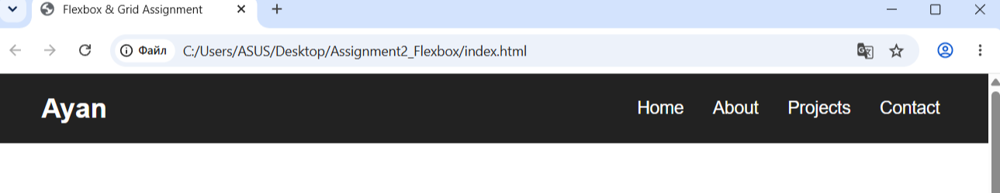
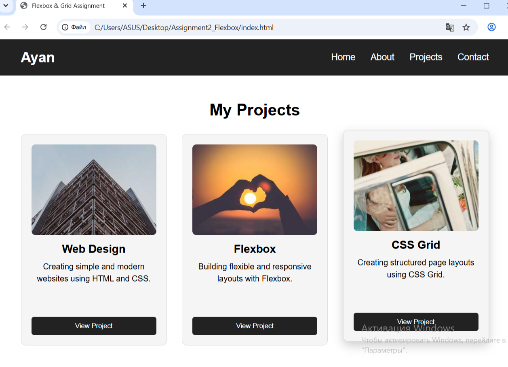
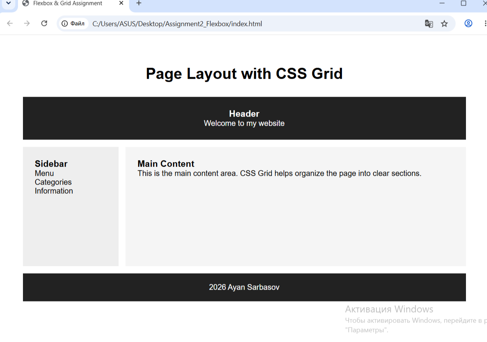
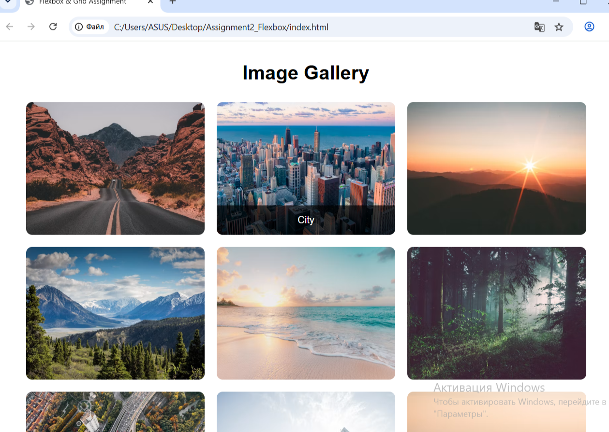
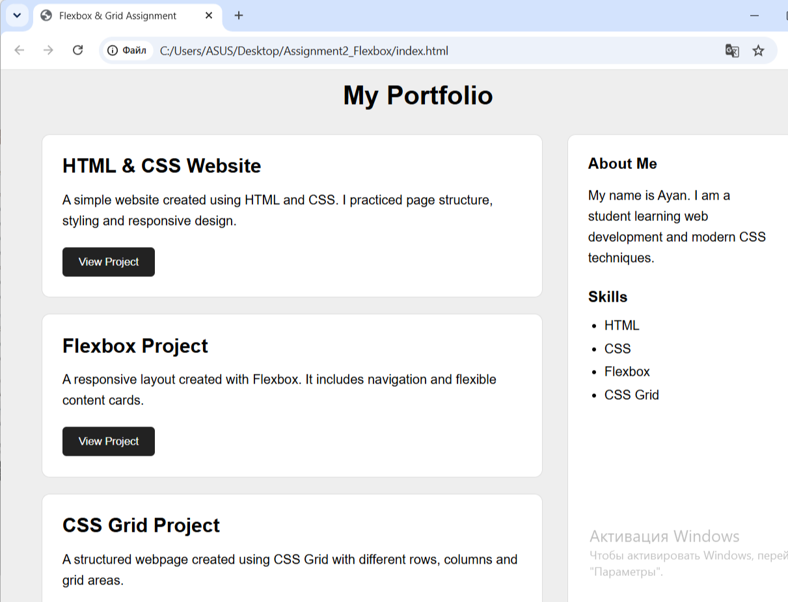

# Assignment #2 — Advanced CSS: Flexbox & Grid

**Name:** Ayan Sarbasov
**Group:** SE2538
**Course:** Web Technologies

## 1. Introduction

This assignment focuses on advanced CSS layout techniques using **Flexbox** and **CSS Grid**.

The main goal of the assignment is to learn how to create modern and responsive web layouts without using floats or CSS frameworks. During this assignment, I practiced alignment, spacing, flexible layouts, grid areas, cards, image galleries, and portfolio layouts.

The project contains five tasks:

* Task 0 — Navigation Bar
* Task 1 — Card Row
* Task 2 — Page Layout with CSS Grid
* Task 3 — Image Gallery
* Task 4 — Portfolio Page

---

## 2. Project Structure

```text
Assignment2_Flexbox/
│
├── index.html
├── style.css
├── README.md
│
└── screenshots/
    ├── task0.png
    ├── task1.png
    ├── task2.png
    ├── task3.png
    └── task4.png
```

### `index.html`

Contains the HTML structure for all tasks.

### `style.css`

Contains the CSS styles for Flexbox, CSS Grid, spacing, alignment, colors, and hover effects.

### `README.md`

Contains information about the assignment, completed tasks, screenshots, and work process.

---

# 3. Part 1 — Flexbox

## Task 0 — Navigation Bar

In this task, I created a navigation bar using CSS Flexbox.

The navigation bar contains:

* A logo on the left
* Navigation links on the right
* Horizontal alignment
* Spacing between the links
* Vertical centering

I used Flexbox properties such as:

```css
display: flex;
justify-content: space-between;
align-items: center;
gap: 30px;
```

I also added a hover effect to the navigation links.

### Screenshot



---

## Task 1 — Card Row

In this task, I created a row of three cards using Flexbox.

Each card contains:

* An image
* A title
* A description
* A button

The cards have equal heights and consistent spacing.

I also used Flexbox inside each card to organize the content vertically. The button stays at the bottom of the card.

A hover effect was added to the cards. When the mouse moves over a card, it moves slightly upward and displays a shadow.

### Screenshot



---

# 4. Part 2 — CSS Grid

## Task 2 — Page Layout with Grid Areas

In this task, I created a page layout using CSS Grid.

The layout contains:

* Header
* Sidebar
* Main content
* Footer

I used `grid-template-areas` to define the position of each section.

The header is placed at the top, the sidebar is on the left, the main content is on the right, and the footer is at the bottom.

Example:

```css
grid-template-areas:
    "header header"
    "sidebar main"
    "footer footer";
```

### Screenshot



---

## Task 3 — Image Gallery

In this task, I created an image gallery containing nine images.

I used CSS Grid to organize the images into three equal-width columns with consistent gaps.

The main Grid property is:

```css
grid-template-columns: repeat(3, 1fr);
```

I also added hover effects. When the user moves the mouse over an image, the image slightly scales and a caption appears.

### Screenshot



---

# 5. Part 3 — Combining Flexbox and Grid

## Task 4 — Portfolio Page

In this task, I combined CSS Grid and Flexbox in one portfolio page.

The portfolio contains:

* Projects area
* Information sidebar
* Project cards
* Footer

I used **CSS Grid** for the main portfolio layout. The projects are placed on the left and the sidebar is placed on the right.

I used **Flexbox** inside each project card to organize the title, description, and button vertically.

This task helped me understand how Flexbox and CSS Grid can be used together in the same webpage.

### Screenshot



---

# 6. Work Process

I started the assignment by creating a basic HTML file and connecting an external CSS file.

First, I created the navigation bar and practiced the main Flexbox properties such as `display: flex`, `justify-content`, `align-items`, and `gap`.

Then, I created three cards and used Flexbox to arrange them in a row and keep them at the same height.

After that, I worked with CSS Grid. I created a page layout with a header, sidebar, main content, and footer using Grid Areas.

Next, I created an image gallery with nine images and used CSS Grid to organize them into three columns. I also added hover effects and captions.

Finally, I combined Flexbox and CSS Grid in a portfolio page. I used Grid for the main structure and Flexbox inside the project cards.

During the work, I tested the webpage in the browser and checked the alignment, spacing, hover effects, and overall layout.

---

# 7. Technologies Used

* HTML5
* CSS3
* Flexbox
* CSS Grid
* Visual Studio Code
* Web Browser

---

# 8. Conclusion

This assignment helped me understand how to create modern webpage layouts using Flexbox and CSS Grid.

I learned how to align elements, create flexible layouts, organize content using Grid Areas, create image galleries, and combine Flexbox and Grid.

I also practiced using hover effects, spacing, borders, and responsive-friendly layout techniques.

Overall, this assignment improved my understanding of modern CSS layout methods and how they can be used to create structured and organized webpages.
